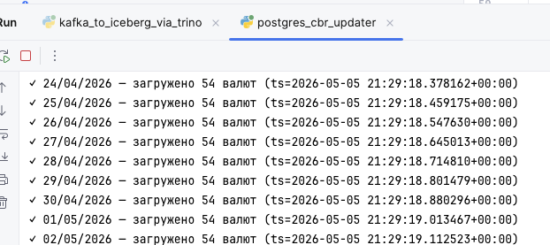
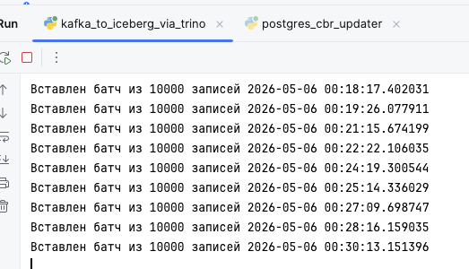
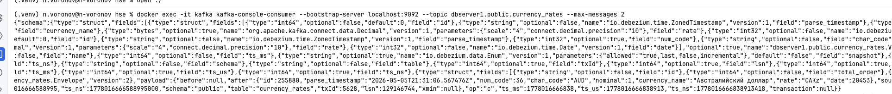
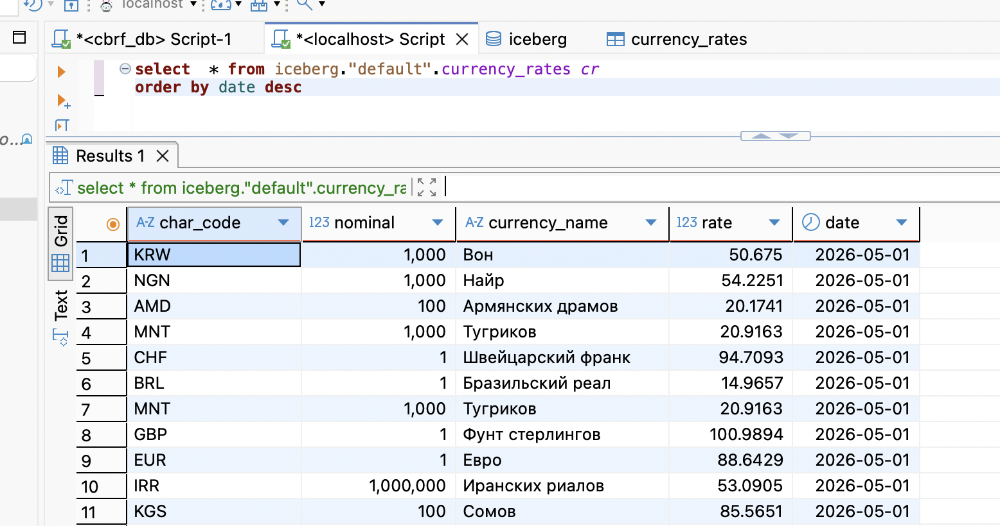
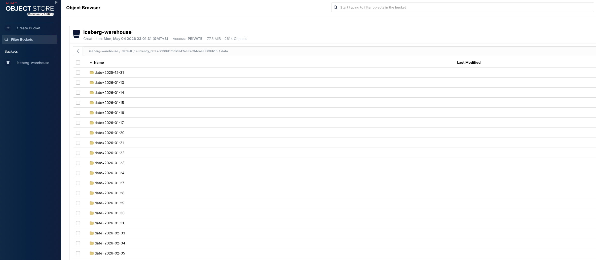
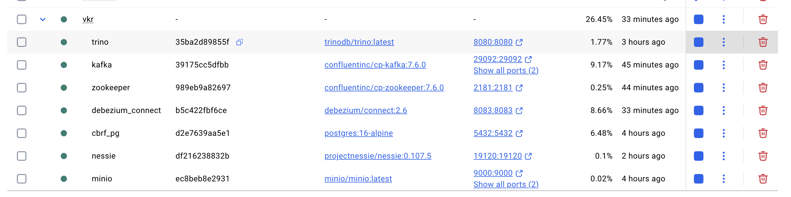
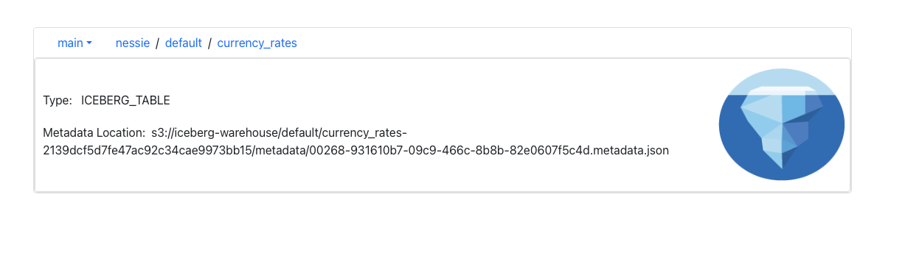

# 🏦 Потоковый сбор и анализ курсов валют ЦБ РФ

Проект реализует **Data Lakehouse** для сбора, хранения и аналитики официальных курсов валют Центрального банка России.

Данные автоматически загружаются в PostgreSQL, в реальном времени передаются через Kafka (CDC) и записываются в аналитическое хранилище на базе **Apache Iceberg**, размещённое в S3‑совместимом **MinIO**. Метаданными управляет Nessie, а аналитические запросы выполняются через **Trino**.

---

## 🧱 Архитектура

```
 Внешний источник (cbr.ru) 
       │
       ▼
┌─────────────────┐
│  Python‑загрузчик │──► PostgreSQL (сырые курсы)
└─────────────────┘           │
                              │ CDC (Debezium)
                              ▼
┌──────────────────────────────────────────┐
│                   Kafka                   │
│  Топик: dbserver1.public.currency_rates  │
└──────────────────────────────────────────┘
       │ (Python‑потребитель + Trino)
       ▼
┌──────────────────────────────────────────┐
│               MinIO (S3)                  │
│       Бакет: iceberg-warehouse            │
└──────────────────────────────────────────┘
       ▲
       │ метаданные таблиц
┌─────────────────┐
│    Nessie        │──► Iceberg REST Catalog
└─────────────────┘
       ▲
       │ SQL
┌─────────────────┐
│      Trino       │──► BI / DBeaver / Metabase
└─────────────────┘
```

**Ключевые компоненты**
- **PostgreSQL 16** – оперативное хранение сырых курсов (партиционированная таблица `currency_rates`).
- **Debezium 2.6** + **Kafka** – захват изменений (CDC) и передача в топик.
- **MinIO** – объектное хранилище, совместимое с AWS S3.
- **Nessie** – каталог Iceberg c REST API (версия 0.107.5).
- **Trino** – распределённый SQL‑движок для аналитики.
- **Python‑скрипты**:
  - `CBRCurrencyLoader` – загрузка курсов в PostgreSQL.
  - `kafka_to_iceberg_via_trino.py` – стриминг из Kafka в Iceberg через Trino.

---

## 📦 Состав репозитория

```
├── docker-compose.yml
├── init.sql                         # Инициализация PostgreSQL (таблицы, партиции, слоты)
├── trino/
│   └── etc/
│       ├── config.properties
│       ├── node.properties
│       ├── jvm.config
│       ├── log.properties
│       └── catalog/
│           └── iceberg.properties   # Подключение Trino к Nessie и MinIO
├── cbr_currency_loader.py           # Загрузчик курсов в PostgreSQL
├── kafka_to_iceberg_via_trino.py   # Потоковая запись CDC‑событий в Iceberg
└── README.md
```

### Первоначальная настройка Debezium
```bash
# Создать публикацию для партиционированной таблицы
docker exec -it cbrf_pg psql -U cbrf_user -d cbrf_db -c \
  "CREATE PUBLICATION debezium_pub FOR TABLE public.currency_rates WITH (publish_via_partition_root = true);"

# Зарегистрировать коннектор
curl -X POST http://localhost:8083/connectors -H "Content-Type: application/json" -d '{
  "name": "cbrf-pg-source",
  "config": {
    "connector.class": "io.debezium.connector.postgresql.PostgresConnector",
    "topic.prefix": "dbserver1",
    "database.hostname": "postgres",
    "database.port": "5432",
    "database.user": "cbrf_user",
    "database.password": "cbrf_pass",
    "database.dbname": "cbrf_db",
    "table.include.list": "public.currency_rates",
    "plugin.name": "pgoutput",
    "slot.name": "debezium",
    "publication.name": "debezium_pub",
    "snapshot.mode": "never"
  }
}'
```

### 4. Создание таблицы Iceberg через Trino
```bash
docker exec -it trino trino --execute "
  CREATE SCHEMA IF NOT EXISTS iceberg.default;
  DROP TABLE IF EXISTS iceberg.default.currency_rates;
  CREATE TABLE iceberg.default.currency_rates (
      char_code VARCHAR,
      nominal INTEGER,
      currency_name VARCHAR,
      rate DOUBLE,
      date DATE
  ) WITH (partitioning = ARRAY['date']);
"
```

---

## 🧪 Проверка работы

Визуальные подтверждения каждого этапа конвейера:

| Компонент | Что видно на скриншоте |
|-----------|------------------------|
| 🐍 **Python‑скрипт записи** | Успешная потоковая вставка записей |
|  | |
| 📡 **Kafka‑streaming** | Потребление CDC‑событий |
|  | |
| 📬 **Kafka‑топик** | Команда `kafka-console-consumer` показывает сообщения |
| `docker exec -it kafka kafka-console-consumer …` | |
|  | |
| 🌐 **Trino Web UI** | Мониторинг запросов в браузере |
| Открыть [http://localhost:8080/ui](http://localhost:8080/ui) | |
| ❄️ **Запрос в Iceberg** | Прямой SQL‑запрос через Trino CLI |
| `docker exec -it trino trino --execute "SELECT * FROM iceberg.default.currency_rates;"` | |
|  | |
| 🪣 **MinIO Console** | Файлы Parquet в бакете `iceberg-warehouse` |
| Доступ: [http://localhost:9001](http://localhost:9001) (minioadmin / minioadmin) | |
|  | |
| 🐳 **Docker‑контейнеры** | Все сервисы в статусе `Up` |
|  | |
| 🧬 **Nessie — список таблиц** | Каталог Iceberg с созданной таблицей |
|  | |
---

## ⚙️ Конфигурация

### PostgreSQL
- Пользователь/БД: `cbrf_user` / `cbrf_db`
- Таблица `currency_rates` партиционирована по месяцам.
- Логическая репликация включена (`wal_level=logical`).

### MinIO
- Доступ: `minioadmin` / `minioadmin`
- Бакет: `iceberg-warehouse` (создаётся автоматически при необходимости).

### Nessie
- REST API: `http://localhost:19120/iceberg/`
- Проверка: `curl http://localhost:19120/iceberg/v1/config`

### Trino
- Порт: 8080

---

## 🧠 Обоснование выбора инструментов

При проектировании конвейера мы ориентировались на **открытость**, **простоту локального развёртывания**, **надёжность захвата изменений** и **возможности для аналитики в реальном времени**. Ниже — краткое объяснение, почему были выбраны именно эти компоненты.

### 🐘 PostgreSQL — оперативное хранение сырых курсов
- **Транзакционность и защита от дубликатов** — при вставке данных мы гарантируем целостность благодаря первичным ключам и уникальным индексам.
- **Встроенная логическая репликация** (`pgoutput`) — PostgreSQL умеет отдавать поток изменений напрямую, без сторонних триггеров, что идеально для Debezium.
- **Партиционирование по дате** — ускоряет запросы и облегчает управление историческими данными.
- Отлично знаком большинству разработчиков, легко разворачивается в Docker.

### ⚡ Debezium + Apache Kafka — захват изменений (CDC)
- **Debezium** — стандарт для CDC с открытым исходным кодом. Он читает WAL PostgreSQL «из коробки», не требует изменения схемы и надёжно передаёт каждое событие в Kafka.
- **Kafka** выполняет роль асинхронного буфера:
  - разделяет производителя (PostgreSQL) и потребителей (наши Python-скрипты, будущие аналитические джобы);
  - гарантирует доставку даже при временных сбоях;
  - позволяет масштабировать потребление независимо.
- Альтернатива без Kafka (читать WAL напрямую) сложнее в реализации, не даёт развязки и устойчивости к перезапускам.

### 🪣 MinIO — объектное S3-совместимое хранилище
- **Полная совместимость с AWS S3 API** — любое приложение, работающее с S3, работает и с MinIO без изменений.
- **Лёгкий и контейнеризируемый** — идеален для локальной разработки; не требует подключения к облаку.
- Поддерживает все функции, необходимые для работы Apache Iceberg: path‑style доступ, статические ключи, HTTP.
- Открытый исходный код, активное сообщество.

### ❄️ Apache Iceberg — формат таблиц для Data Lakehouse
- **ACID‑транзакции, эволюция схемы, партиционирование «скрыто» от пользователя** — упрощает работу с большими объёмами данных.
- **Открытая спецификация** — не привязана к конкретному движку или облаку; поддерживается Trino, Spark, Flink и другими.
- **Лучшая производительность с Trino** по сравнению с Delta Lake и Hudi для интерактивных аналитических запросов.
- Хранение в формате **Parquet** с эффективным сжатием.

### 🗃️ Nessie — каталог Iceberg с Git-подобной версионностью
- **Ветвление и изоляция сред** — можно тестировать изменения схемы или данных в отдельной ветке, не затрагивая основную.
- **REST API** — простой способ управления метаданными из любого инструмента.
- **Не зависит от облака** — в отличие от AWS Glue или Hive Metastore, легко работает с MinIO в Docker.
- **Прямая интеграция с Trino** через `iceberg.catalog.type=nessie` — все запросы автоматически используют актуальные метаданные.

### 🚀 Trino — аналитический SQL-движок
- **Создан для интерактивной аналитики** — выполняет распределённые запросы быстрее, чем Spark SQL, особенно на средних объёмах.
- **Федеративные запросы** — может одновременно обращаться к Iceberg, PostgreSQL, Kafka и другим источникам.
- **Стандартный SQL** — совместим с DBeaver, Metabase, Superset и любыми BI‑инструментами.
- **Лёгкий в развёртывании** — достаточно одного координатора и воркеров, не требует кластера Hadoop.

### 🐍 Python-скрипты — загрузка и стриминг
- **Гибкость и простота разработки** — парсинг XML с ЦБ РФ, обработка Debezium-сообщений, вставка в Trino реализованы минимальным объёмом кода.
- **Не требуют тяжелых фреймворков** — в отличие от Spark или Flink, Python-потребитель Kafka + Trino‑клиент достаточен для демонстрационных и средних нагрузок.
- **Батчевая вставка** через Trino обеспечивает хорошую пропускную способность без лишней инфраструктуры.
- Легко расширяется и отлаживается.

### 🐳 Docker Compose — единая среда исполнения
- **Воспроизводимость** — все компоненты запускаются одной командой, с фиксированными версиями и настройками.
- **Изоляция** — сервисы общаются по внутренней сети, не конфликтуя с хост-системой.
- **Простота масштабирования** - при необходимости можно добавить новые контейнеры (Spark, Flink, Airflow) без изменения существующей конфигурации.

---

> Все компоненты являются **открытыми и бесплатными** для использования, имеют активные сообщества и хорошо документированы. Такой стек позволяет не только успешно выполнить задачу, но и служит отличной основой для построения более сложных промышленных систем.